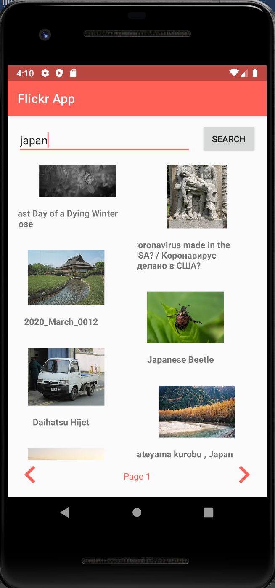

# Flickr App
A Project to show implementation of Flickr API , written in kotlin using MVVM design pattern.

### This project uses:
* **Live Data** - For Reactive Programming
* **Dagger 2** - For Dependency Injection
* **Retrofit 2** - As Type Safe HTTP client
* **Data binding** - To Bind Data with XML layouts
* **Picasso** - Loading Images
